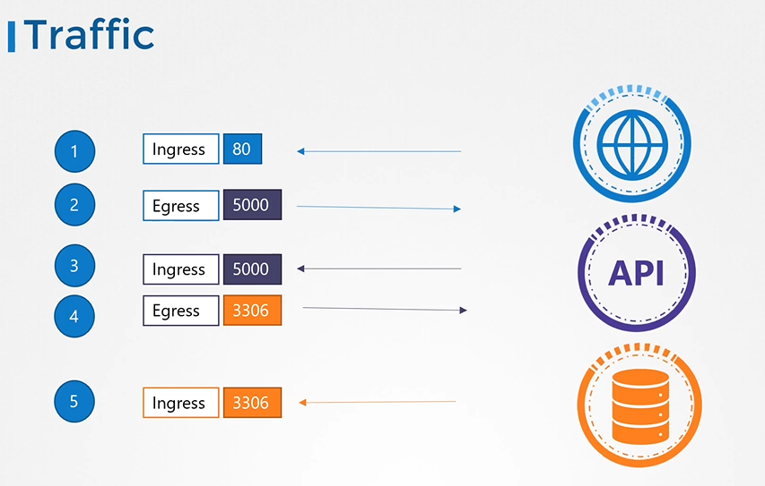
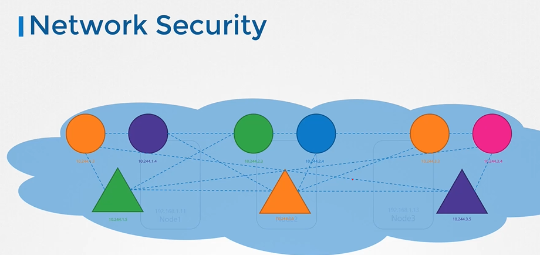
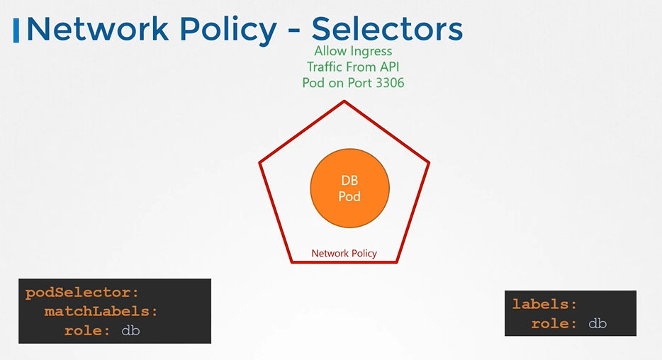
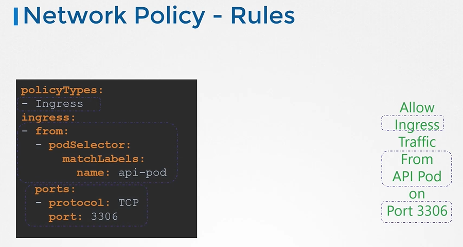

# Network Policies
  - Take me to [Video Tutorials](https://kodekloud.com/topic/network-policies-3/)
In this lecture on network policies in Kubernetes, the instructor provides a comprehensive overview of networking and security concepts before delving into the specifics of implementing network policies. Here's a summary:

1. **Networking and Security Basics**:
   - The lecture starts with a simple example of traffic flow between a web server, an API server, and a database server.
   - Two types of traffic are identified: ingress (incoming) and egress (outgoing).
   - Rules for traffic flow are discussed, such as allowing HTTP traffic on port 80 for the web server and database traffic on port 3306.

2. **Network Security in Kubernetes**:
   - Kubernetes clusters consist of nodes hosting pods and services, each with its IP address.
   - Pods should be able to communicate with each other by default.
   - Kubernetes is configured with an "all allow" rule by default, allowing traffic between any pods or services within the cluster.

3. **Application in Kubernetes**:
   - Each component of an application (e.g., front end, API server, database) is deployed as a pod.
   - Services are created to facilitate communication between pods and end-users.
   - The default communication between pods can be restricted using network policies.

4. **Implementing Network Policies**:
   - Network policies are Kubernetes objects linked to one or more pods.
   - Rules within a network policy define allowed traffic.
   - Network policies use labels and selectors to link to pods and define rules for ingress or egress traffic.
   - Example: Creating a network policy to allow ingress traffic to the database pod only from the API pod on port 3306.

5. **Configuration**:
   - Network policies are defined in YAML files specifying API version, kind, metadata, and spec.
   - Policy types (ingress, egress) determine the type of traffic isolation enforced.
   - The `spec` section includes pod selectors and rules defining allowed traffic.

6. **Enforcement and Considerations**:
   - Network policies are enforced by the network solution implemented in the Kubernetes cluster.
   - Not all network solutions support network policies; supported solutions include Cube Router, Calico, Romana, and WaveNet.
   - Even if the network solution doesn't support network policies, you can create them, but they won't be enforced.

7. **Conclusion**:
   - Understanding network policies is crucial for implementing secure communication between pods in Kubernetes.
   - Practice exercises are recommended for further understanding and implementation of network policies.

Overall, the lecture provides a clear explanation of network policies in Kubernetes, from basic concepts to practical implementation, ensuring a solid understanding for viewers.

=====================================================================================================

In this lecture, the instructor delves deeper into network policies in Kubernetes, focusing on specific use cases and how to configure them effectively. Here's a summary of the key points covered:

1. **Requirements Clarification**:
   - The goal is to protect the database pod from unauthorized access, allowing traffic only from the API pod on port 3306.
   - The web pod and API pod are assumed to be unrestricted.

2. **Initial Policy Creation**:
   - Start by creating a network policy named `db-policy` and associate it with the database pod using labels and selectors.
   - The policy initially blocks all traffic to and from the database pod.

3. **Ingress Rules**:
   - Decide on the type of policy needed based on the direction of traffic.
   - Create an ingress rule to allow traffic from the API pod to the database pod on port 3306.
   - Understand that ingress rules automatically allow response traffic back to the source.

4. **Handling Multiple API Pods in Different Namespaces**:
   - Use a namespace selector in addition to the pod selector to restrict traffic to the API pod in a specific namespace.
   - Ensure the namespace has the required label for the selector to work effectively.

5. **Allowing Traffic from External Sources**:
   - Introduce the concept of IP block selectors to allow traffic from specific IP addresses, such as an external backup server.
   - Differentiate between selectors operating as an AND or OR operation within rules.

6. **Egress Rules**:
   - Add egress rules to allow traffic originating from the database pod to external destinations, such as the backup server.
   - Specify the IP address of the external server and the port for outgoing traffic.

7. **Practice**:
   - Encourage learners to practice creating and configuring network policies in Kubernetes to solidify their understanding.

Overall, the lecture provides a detailed explanation of network policy configuration in Kubernetes, covering various scenarios and strategies for effective implementation.


=============================================================================================================================


#### Trafic flowing through a webserver serving frontend to users an app server serving backend API and a database server

  
  
- There are two types of traffic
  - Ingress
  - Egress
  
   
  
   
  
## Network Security

  
  
## Network Policy

  
  
  
  
## Network Policy Selectors
  
  
  
## Network Policy Rules

  
  
## Create network policy
 
- To create a network policy
  ```
  apiVersion: networking.k8s.io/v1
  kind: NetworkPolicy
  metadata:
   name: db-policy
  spec:
    podSelector:
      matchLabels:
        role: db
    policyTypes:
    - Ingress
    ingress:
    - from:
      - podSelector:
          matchLabels:
            role: api-pod
      ports:
      - protocol: TCP
        port: 3306
  ```
  
  ```
  $ kubectl create -f policy-definition.yaml
  ```
  
 
 
 
  
## Note
 
 
 
#### Additional lecture on [Developing Networking Policies](https://kodekloud.com/topic/developing-network-policies/)

#### K8s Reference Docs
- https://kubernetes.io/docs/concepts/services-networking/network-policies/
- https://kubernetes.io/docs/tasks/administer-cluster/declare-network-policy/
 
  
  
  
  
