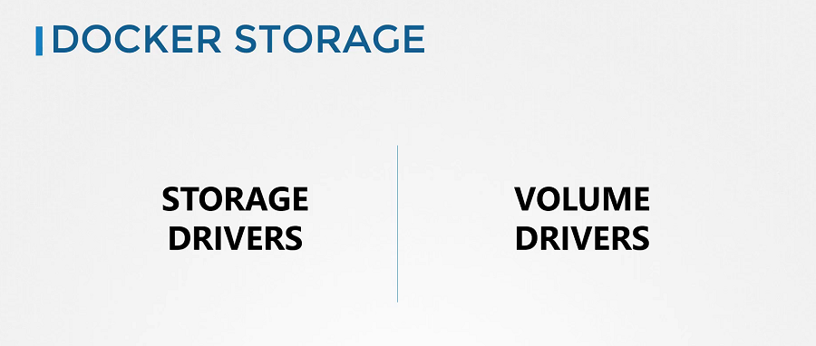

# Introduction to Docker Storage

  - Take me to [Lecture](https://kodekloud.com/topic/introduction-to-docker-storage-3/)
  In this segment, the instructor delves into storage concepts in Kubernetes, emphasizing the importance of understanding storage in container orchestration tools like Kubernetes. Before exploring storage in Kubernetes, the instructor suggests grasping the fundamentals of storage in Docker, particularly focusing on storage drivers and volume driver plugins. The upcoming video will specifically cover storage drivers, a topic previously discussed in the Docker course. Learners familiar with this topic can skip ahead, while others may choose to review for a refresher before proceeding to explore volume drivers.
==========================================================================================

In this section, we will take a look at **Docker storage**.

- To understand storage in the container orchestration tools like **Kubernetes**, It is important to first understand how storage works with containers. Understanding how storage works with **Docker** first and getting all the basics right will later make it so much easier to understand how it works in **Kubernetes**.

- If you are new to **Docker** then you can learn some basics of docker from the course [Docker for the absolute beginner course](https://kodekloud.com/courses/docker-for-the-absolute-beginner/), that is free. 

## Docker Storage

- There are two concepts comes into the docker, Storage drivers and Volume drivers plugins. 

#### We will first discuss about Storage drivers.

#### Docker Reference Docs

- https://docs.docker.com/storage/storagedriver/
- https://docs.docker.com/storage/volumes/
