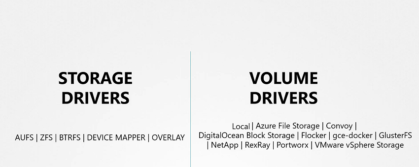
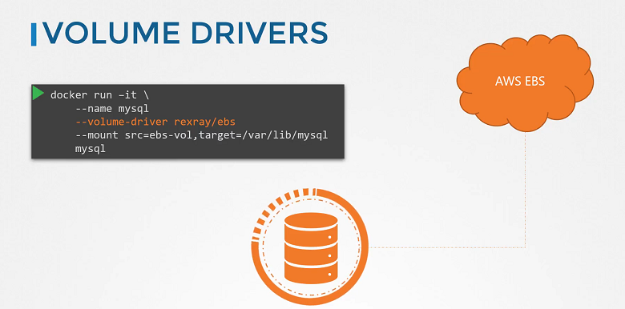

# Volume Driver Plugins in Docker

  - Take me to [Lecture](https://kodekloud.com/topic/volume-driver-plugins-in-docker-4/)
In this lecture, the instructor reviews key concepts discussed in the previous session regarding storage drivers and volumes in Docker.

First, storage drivers are summarized as tools for managing storage on images and containers. It's emphasized that volumes are essential for persisting storage, and they are managed by volume driver plugins, not storage drivers.

The default volume driver plugin in Docker is "local," which creates volumes on the Docker host and stores data in the `/var/lib/docker/volumes` directory. However, there are numerous other volume driver plugins available, enabling integration with various third-party storage solutions.

The lecture lists several volume driver plugins, including Azure File Storage, Convoy, DigitalOcean Block Storage, Flocker, Google Compute Persistent Disks, Cluster FS, NetApp, REX-Ray, Portworx, and VMware vSphere storage. It's noted that these plugins support different storage providers, offering flexibility in provisioning storage resources.

An example is provided with the REX-Ray storage driver, which can provision storage on various platforms such as AWS EBS, S3, EMC storage arrays (Isilon and ScaleIO), Google Persistent Disk, or OpenStack Cinder. By specifying a specific volume driver like REX-Ray EBS when running a Docker container, users can provision volumes from cloud providers like AWS.

The lecture concludes by hinting at further exploration of volumes in Kubernetes, suggesting upcoming lectures will delve deeper into this topic.


=============================================================================================


In this section, we will take a look at **Volume Driver Plugins in Docker**

- We discussed about Storage drivers. Storage drivers help to manage storage on images and containers.
- We have already seen that if you want to persist storage, you must create volumes. Volumes are not handled by the storage drivers. Volumes are handled by volume driver plugins. The default volume driver plugin is local.
- The local volume plugin helps to create a volume on Docker host and store its data under the `/var/lib/docker/volumes/` directory.
- There are many other volume driver plugins that allow you to create a volume on third-party solutions like Azure file storage, DigitalOcean Block Storage, Portworx, Google Compute Persistent Disks etc.





- When you run a Docker container, you can choose to use a specific volume driver, such as the RexRay EBS to provision a volume from the Amazon EBS. This will create a container and attach a volume from the AWS cloud. When the container exits, your data is safe in the cloud.

```
$ docker run -it --name mysql --volume-driver rexray/ebs --mount src=ebs-vol,target=/var/lib/mysql mysql
```





#### Docker Reference Docs

- https://docs.docker.com/engine/extend/legacy_plugins/
- https://github.com/rexray/rexray

