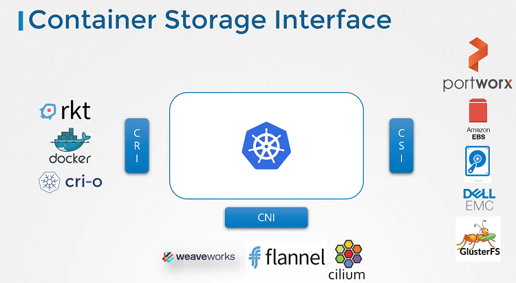

# Container Storage Interface

  - Take me to [Lecture](https://kodekloud.com/topic/container-storage-interface/)
In this lecture, the instructor introduces the Container Storage Interface (CSI) and its significance in the Kubernetes ecosystem.

Initially, Kubernetes was tightly coupled with Docker as the container runtime engine, embedding Docker-related code within Kubernetes. However, as alternative container runtimes like RKT and CRI-O emerged, there was a need to standardize communication between Kubernetes and different runtimes. This led to the development of the Container Runtime Interface (CRI), allowing new runtimes to integrate with Kubernetes without modifying its source code.

Similarly, to support various storage solutions, the Container Storage Interface (CSI) was introduced. CSI serves as a universal standard for interacting with storage systems in container orchestration environments. With CSI, storage vendors can develop their own drivers to seamlessly integrate their solutions with Kubernetes.

The lecture highlights the universality of CSI, emphasizing that it's not specific to Kubernetes but can be implemented by any container orchestration tool. Currently, Kubernetes, Cloud Foundry, and Mesos support CSI, enabling interoperability between different storage vendors and container platforms.

CSI defines a set of Remote Procedure Calls (RPCs) that the container orchestrator (e.g., Kubernetes) invokes, which must be implemented by storage drivers. These RPCs include operations such as creating and deleting volumes, with specific parameters and error codes outlined in the CSI specification.

The instructor encourages further exploration of CSI by directing learners to the CSI specification on GitHub for detailed information.

Overall, the lecture provides a comprehensive overview of CSI and its role in enabling seamless integration of various storage solutions with Kubernetes.

=======================================================================================

In this section, we will take a look at **Container Storage Interface**

## Container Runtime Interface

- Kubernetes used Docker alone as the container runtime engine, and all the code to work with Docker was embedded within the Kubernetes source code. Other container runtimes, such as rkt and CRI-O.
- The Container Runtime Interface is a standard that defines how an orchestration solution like Kubernetes would communicate with container runtimes like Docker. If any new container runtime interace is developed, they can simply follow the CRI standards.

## Container Networking Interface

- To support different networking solutions, the container networking interface was introduced. Any new networking vendors could simply develop their plugin based on the CNI standards and make their solution work with Kubernetes.

## Container Storage Interface

- The container storage interface was developed to support multiple storage solutions. With CSI, you can now write your own drivers for your own storage to work with Kubernetes. Portworx, Amazon EBS, Azure Disk, GlusterFS etc.
- CSI is not a Kubernetes specific standard. It is meant to be a universal standard and if implemented, allows any container orchestration tool to work with any storage vendor with a supported plugin. Kubernetes, Cloud Foundry and Mesos are onboard with CSI.
- It defines a set of RPCs or remote procedure calls that will be called by the container orchestrator. These must be implemented by the storage drivers.

#### Container Storage Interface 

- https://github.com/container-storage-interface/spec
- https://kubernetes-csi.github.io/docs/
- http://mesos.apache.org/documentation/latest/csi/
- https://www.nomadproject.io/docs/internals/plugins/csi#volume-lifecycle
