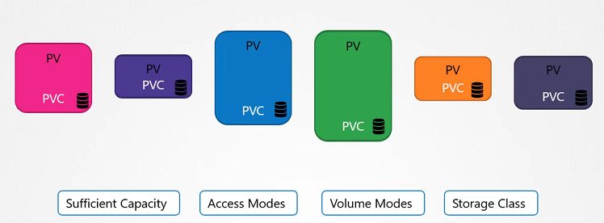

# Persistent Volume Claims

  - Take me to [Lecture](https://kodekloud.com/topic/persistent-volume-claims-4/)
In this lecture, the focus is on Persistent Volume Claims (PVCs) in Kubernetes, following the creation of a Persistent Volume (PV) in the previous lecture. Mumshad explains that PVs and PVCs are separate objects in the Kubernetes namespace. Administrators create PVs, and users create PVCs to utilize the storage.

Key points covered include:

1. **Relationship Between PVs and PVCs**: Each PVC is bound to a single PV. Kubernetes matches PVCs to PVs based on requests and properties like capacity, access modes, and storage class.

2. **Binding Process**: Kubernetes tries to find a PV with sufficient capacity and matching properties. If multiple matches are possible, labels and selectors can be used for specific bindings. Smaller claims may bind to larger volumes if criteria match.

3. **Pending State**: If no suitable PVs are available, PVCs remain in a pending state until new volumes are accessible.

4. **Creating PVCs**: Mumshad demonstrates creating a PVC named "My Claim" with specific specifications using `kubectl create` command.

5. **Viewing and Deleting PVCs**: The lecture shows how to view and delete PVCs using `kubectl get` and `kubectl delete` commands, respectively.

6. **Handling PVs Upon PVC Deletion**: Mumshad explains the options for handling PVs upon PVC deletion: retain, delete, or recycle.

The lecture concludes by encouraging learners to practice configuring and troubleshooting persistent volumes and volume claims in Kubernetes.

==================================================================================================


In this section, we will take a look at **Persistent Volume Claim**

- Now we will create a Persistent Volume Claim to make the storage available to the node.
- Volumes and Persistent Volume Claim are two separate objects in the Kubernetes namespace.
- Once the Persistent Volume Claim created, Kubernetes binds the Persistent Volumes to claim based on the request and properties set on the volume.




- If properties not matches or Persistent Volume is not available for the Persistent Volume Claim then it will display the pending state.

```
pvc-definition.yaml

kind: PersistentVolumeClaim
apiVersion: v1
metadata:
  name: myclaim
spec:
  accessModes: [ "ReadWriteOnce" ]
  resources:
   requests:
     storage: 1Gi
```

```
pv-definition.yaml

kind: PersistentVolume
apiVersion: v1
metadata:
    name: pv-vol1
spec:
    accessModes: [ "ReadWriteOnce" ]
    capacity:
     storage: 1Gi
    hostPath:
     path: /tmp/data
```

#### Create the Persistent Volume

```
$ kubectl create -f pv-definition.yaml
persistentvolume/pv-vol1 created

$ kubectl get pv
NAME      CAPACITY   ACCESS MODES   RECLAIM POLICY   STATUS      CLAIM   STORAGECLASS   REASON   AGE
pv-vol1   1Gi        RWO            Retain           Available                                   10s
```


#### Create the Persistent Volume Claim

```
$ kubectl create -f pvc-definition.yaml
persistentvolumeclaim/myclaim created

$ kubectl get pvc
NAME      STATUS    VOLUME   CAPACITY   ACCESS MODES   STORAGECLASS   AGE
myclaim   Pending                                                     35s

$ kubectl get pvc
NAME      STATUS   VOLUME    CAPACITY   ACCESS MODES   STORAGECLASS   AGE
myclaim   Bound    pv-vol1   1Gi        RWO                           1min

```

#### Delete the Persistent Volume Claim

```
$ kubectl delete pvc myclaim
```

#### Delete the Persistent Volume

```
$ kubectl delete pv pv-vol1
```


#### Kubernetes Persistent Volume Claims Reference Docs

- https://kubernetes.io/docs/concepts/storage/persistent-volumes/#persistentvolumeclaims
- https://kubernetes.io/docs/reference/generated/kubernetes-api/v1.18/#persistentvolumeclaim-v1-core
- https://docs.cloud.oracle.com/en-us/iaas/Content/ContEng/Tasks/contengcreatingpersistentvolumeclaim.htm
