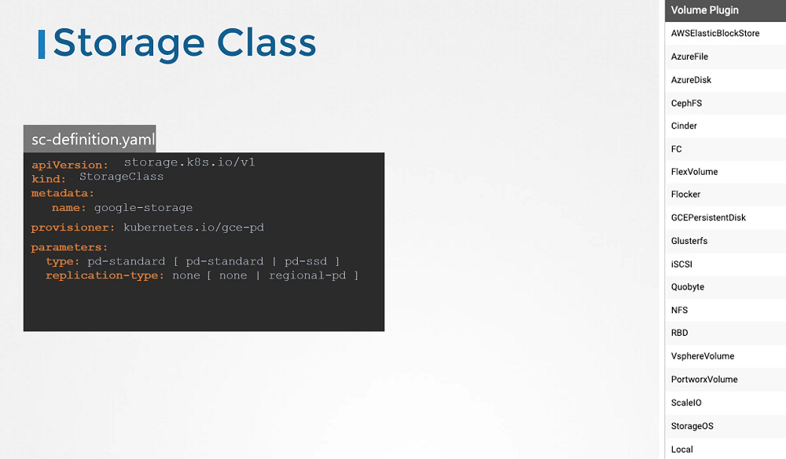

# Storage Class

  - Take me to [Lecture](https://kodekloud.com/topic/storage-class/)
In this lecture, the focus is on Storage Classes in Kubernetes, which enable dynamic provisioning of volumes, eliminating the need for manual volume creation.

Key points covered include:

1. **Static Provisioning vs. Dynamic Provisioning**: Previously, to use persistent storage, administrators had to manually provision disks and create PV definitions. With dynamic provisioning, storage is automatically provisioned when needed.

2. **Introduction to Storage Classes**: Storage Classes allow administrators to define provisioners (e.g., Google Storage) for automatic storage provisioning. This enables dynamic provisioning of volumes.

3. **Creating Storage Classes**: To create a Storage Class, an object is defined with API version `storage.k8.io/v1`, a name, and a provisioner (e.g., `Kubernetes.io/gce-pd` for Google Cloud).

4. **Using Storage Classes with PVCs**: By specifying the Storage Class name in the PVC definition, Kubernetes knows which provisioner to use for dynamic volume provisioning.

5. **Automated PV Creation**: When a PVC is created, the associated Storage Class automatically provisions a new disk on the cloud provider (e.g., GCP), creates a PV, and binds the PVC to that volume.

6. **Available Provisioners**: Various provisioners are available for different cloud providers and storage types, such as AWS EBS, Azure File, Azure Disk, CephFS, Portworx, and ScaleIO.

7. **Customizing Storage Classes**: Parameters specific to the provisioner can be passed in, such as disk type (standard, SSD), replication mode (none, regional PD), etc.

8. **Creating Different Classes of Service**: Different Storage Classes can be created for different types of disks (e.g., silver, gold, platinum) to provide varying levels of service based on requirements.

Overall, Storage Classes enable administrators to define different classes of service and simplify PVC creation by specifying the desired class of storage needed for volumes.


======================================================================================================


In this section, we will take a look at **Storage Class**

- We discussed about how to create Persistent Volume and Persistent Volume Claim and We also saw that how to use into the Pod's volume to claim that volume space.
- We created Persistent Volume but before this if we are taking a volume from Cloud providers like GCP, AWS, Azure. We need to first create disk in the Google Cloud as an example. 
- We need to create manually each time when we define in the Pod definition file. that's called **Static Provisioning**. 

#### Static Provisioning


#### Dynamic Provisioning


- No we have a Storage Class, So we no longer to define Persistent Volume. It will create automatically when a Storage Class is created. It's called **Dynamic Provisioning**. 

```
sc-definition.yaml

apiVersion: storage.k8s.io/v1
kind: StorageClass
metadata:
   name: google-storage
provisioner: kubernetes.io/gce-pd
```

#### Create a Storage Class

```
$ kubectl create -f sc-definition.yaml
storageclass.storage.k8s.io/google-storage created
```

#### List the Storage Class

```
$ kubectl get sc
NAME             PROVISIONER            RECLAIMPOLICY   VOLUMEBINDINGMODE   ALLOWVOLUMEEXPANSION   AGE
google-storage   kubernetes.io/gce-pd   Delete          Immediate           false                  20s
```

#### Create a Persistent Volume Claim

```
pvc-definition.yaml

kind: PersistentVolumeClaim
apiVersion: v1
metadata:
  name: myclaim
spec:
  accessModes: [ "ReadWriteOnce" ]
  storageClassName: google-storage       
  resources:
   requests:
     storage: 500Mi
```
```
$ kubectl create -f pvc-definition.yaml

```
#### Create a Pod

```
pod-definition.yaml

apiVersion: v1
kind: Pod
metadata:
  name: mypod
spec:
  containers:
    - name: frontend
      image: nginx
      volumeMounts:
      - mountPath: "/var/www/html"
        name: web
  volumes:
    - name: web
      persistentVolumeClaim:
        claimName: myclaim
```
```
$ kubectl create -f pod-definition.yaml
```
#### Provisioner



#### Kubernetes Storage Class Reference Docs

- https://kubernetes.io/docs/concepts/storage/storage-classes/
- https://cloud.google.com/kubernetes-engine/docs/concepts/persistent-volumes#storageclasses
- https://docs.aws.amazon.com/eks/latest/userguide/storage-classes.html
