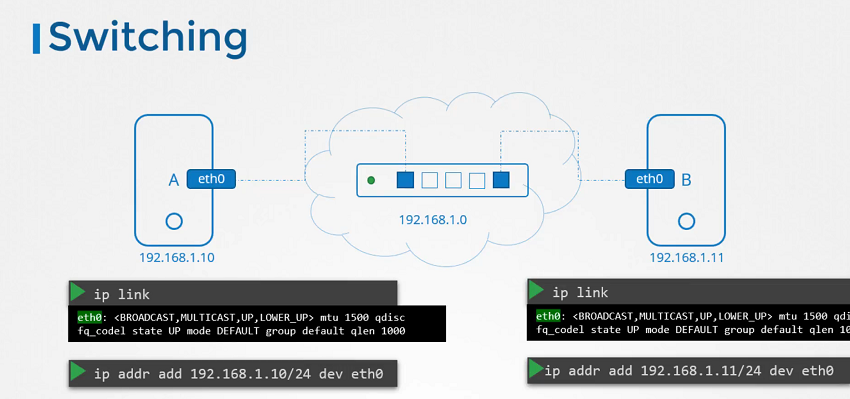

# Pre-requisite Switching Routing Gateways
In this series of lectures, the focus is on understanding basic networking concepts from a Linux perspective, aimed at system administrators and application developers. Key points covered include:

1. **Networking Basics**: Concepts like switching, routing, gateways, and DNS are introduced, providing a foundation for understanding networking in Kubernetes.

2. **CoreDNS Introduction**: A basic overview of CoreDNS, a flexible DNS server that can be easily configured, is provided.

3. **DNS Configuration**: The process of configuring DNS settings on a Linux system is explained, including setting up CoreDNS.

4. **Network Namespaces**: Basics of network namespaces in Linux are covered, which allow for the isolation of network resources.

5. **Command Usage**: Various Linux commands like `ip link`, `ip addr`, `ip route`, and `route` are demonstrated for viewing and configuring network interfaces, IP addresses, and routing tables.

6. **Gateway Configuration**: Setting up gateways and routes for inter-network communication is explained, along with the use of routing tables.

7. **Forwarding Packets**: Enabling packet forwarding between interfaces on a Linux system is discussed, along with the associated security considerations.

8. **Persistence**: Ensuring that network configuration changes persist across reboots by modifying configuration files like `/etc/sysctl.conf` is emphasized.

9. **Key Commands**: Important commands like `ip link`, `ip addr`, `ip route`, `route`, and `sysctl` are highlighted for managing network configuration.

By focusing on practical aspects and providing hands-on examples, these lectures aim to equip learners with the necessary networking knowledge to understand Kubernetes networking configurations and troubleshooting.


=====================================================================================================


  - Take me to [Lecture](https://kodekloud.com/topic/pre-requisite-switching-routing-gateways-cni-in-kubernetes/)

In this section, we will take a look at **Switching, Routing and Gateways**

## Switching

- To see the interface on the host system

```
$ ip link
```
- To see the IP Address interfaces.

```
$ ip addr
```



## Routing

- To see the existing routing table on the host system.

```
$ route
```
```
$ ip route show
or
$ ip route list
```

- To add entries into the routing table.

```
$ ip route add 192.168.1.0/24 via 192.168.2.1
```


## Gateways

- To add a default route.
```
$ ip route add default via 192.168.2.1
```

- To check the IP forwarding is enabled on the host.
```
$ cat /proc/sys/net/ipv4/ip_forward
0

$ echo 1 > /proc/sys/net/ipv4/ip_forward
```

- Enable packet forwarding for IPv4.
```
$ cat /etc/sysctl.conf

# Uncomment the line
net.ipv4.ip_forward=1
```

- To view the sysctl variables.
```
$ sysctl -a 
```

- To reload the sysctl configuration.
```
$ sysctl --system
```


