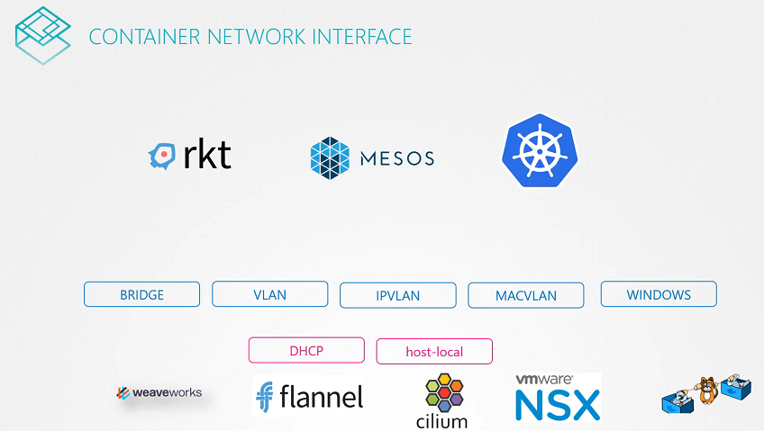

# Pre-requisite CNI

  - Take me to [Lecture](https://kodekloud.com/topic/prerequsite-cni/)
In this lecture, the focus is on the Container Networking Interface (CNI), which standardizes the approach to networking in container runtime environments. Here's a breakdown:

1. **Motivation for CNI**: The lecture begins by questioning why different container solutions develop similar networking solutions independently. It proposes the idea of a standardized approach to container networking to avoid redundant development efforts.

2. **Introduction to CNI**: CNI is presented as a set of standards defining how networking plugins should be developed to address networking challenges in container runtime environments.

3. **CNI Plugins**: Plugins are programs that adhere to the CNI standards. The lecture discusses a hypothetical "Bridge" program, which is considered a plugin for CNI. These plugins are responsible for tasks like assigning IP addresses to containers and configuring routes.

4. **Responsibilities Defined by CNI**: CNI specifies the responsibilities of container runtimes and plugins. Container runtimes are responsible for creating network namespaces, identifying networks for containers, and invoking plugins during container creation and deletion.

5. **Standardized Format**: CNI defines a standardized format for configuring network plugins using JSON files and specifies the command-line arguments that plugins should support.

6. **Supported Plugins**: The lecture mentions several supported plugins included with CNI, such as Bridge, VLAN, MAC VLAN, and IPAM plugins like Host Local and DHCP. It also acknowledges third-party plugins like Weave, Flannel, and Calico.

7. **Docker and CNI**: While Docker does not implement CNI, it has its own standards known as CNM (Container Network Model). This means CNI plugins cannot natively integrate with Docker, but workarounds can be implemented.

8. **Kubernetes and CNI**: Kubernetes, a popular container orchestration platform, leverages CNI for container networking. It creates Docker containers without network configuration and then invokes CNI plugins to handle networking tasks.

Overall, the lecture highlights the importance of standardized approaches like CNI in simplifying container networking across different container runtime environments.


================================================================================================


In this section, we will take a look at **Pre-requisite Container Network Interface(CNI)**




## Third Party Network Plugin Providers

- [Weave](https://www.weave.works/docs/net/latest/kubernetes/kube-addon/#-installation)
- [Calico](https://docs.projectcalico.org/getting-started/kubernetes/quickstart)
- [Flannel](https://github.com/coreos/flannel/blob/master/Documentation/kubernetes.md)
- [Cilium](https://github.com/cilium/cilium)


## To view the CNI Network Plugins

- CNI comes with the set of supported network plugins. 

```
$ ls /opt/cni/bin/
bridge  dhcp  flannel  host-device  host-local  ipvlan  loopback  macvlan  portmap  ptp  sample  tuning  vlan
```


#### References Docs

- https://kubernetes.io/docs/concepts/extend-kubernetes/compute-storage-net/network-plugins/


