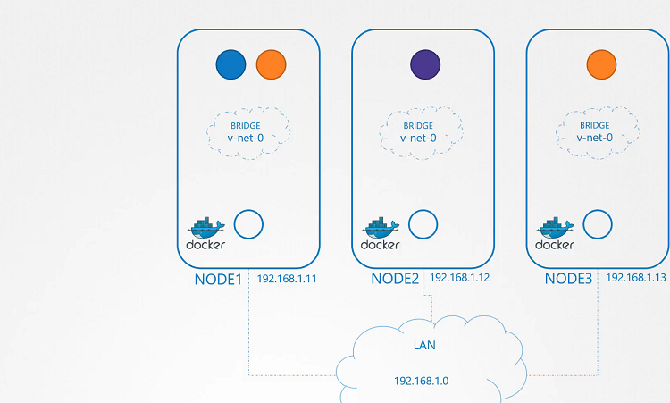
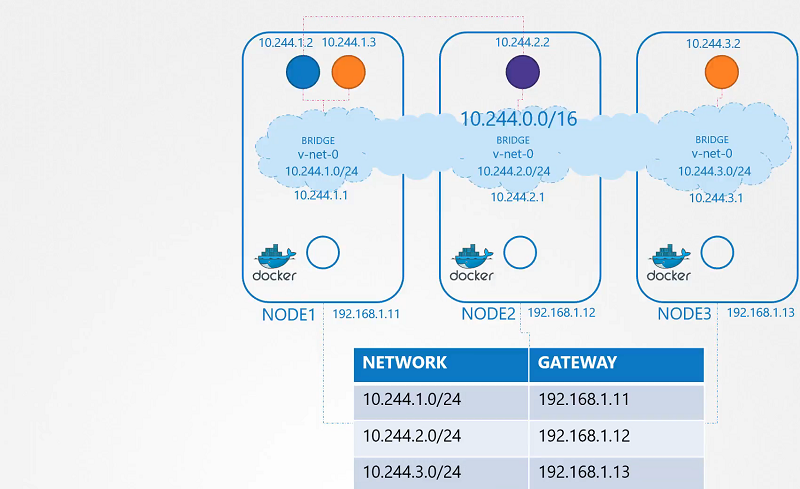

# Pod Networking

  - Take me to [Lecture](https://kodekloud.com/topic/pod-networking/)
In this lecture, the focus is on pod networking within a Kubernetes cluster. Here's a summary:

1. **Overview**: After setting up Kubernetes master and worker nodes and configuring networking between them, the next step is to address pod networking. This involves ensuring that pods can communicate with each other within and across nodes.

2. **Kubernetes Requirements**: Kubernetes expects every pod to have a unique IP address, allowing communication between pods within the same node and across nodes without the need for NAT rules.

3. **Solution Approach**: Instead of relying on built-in solutions, the lecture proposes a manual approach using networking concepts like namespaces, routing, and IP address management. A script is written to assign IP addresses, create virtual network interfaces, and set up routing tables for pod communication.

4. **Implementation Steps**: The process involves:
   - Creating a bridge network on each node.
   - Assigning unique IP addresses to bridge interfaces.
   - Writing a script to configure pod networking for each container.
   - Manually executing the script on each node for pod connectivity.

5. **Scaling Challenges**: While the manual approach works for small setups, it becomes cumbersome at scale. To automate pod networking setup, the Container Network Interface (CNI) serves as a middleman between Kubernetes and the networking script, ensuring standardization and automation.

6. **CNI Integration**: The script is modified to meet CNI standards, with sections for adding and deleting containers from the network. The container runtime invokes the script based on CNI configuration, automating pod networking setup.

7. **Next Steps**: The lecture concludes by highlighting upcoming topics, including configuring CNI in Kubernetes and exploring other networking solutions.

Overall, the lecture provides a comprehensive understanding of pod networking concepts and outlines a manual approach to configure pod communication, paving the way for automation using CNI in Kubernetes.


==================================================================================


In this section, we will take a look at **Pod Networking**


- To add bridge network on each node

> node01
```
$ ip link add v-net-0 type bridge
```
> node02
```
$ ip link add v-net-0 type bridge
```

> node03
```
$ ip link add v-net-0 type bridge
```

- Currently it's down, turn it up.

> node01
```
$ ip link set dev v-net-0 up
```

> node02
```
$ ip link set dev v-net-0 up
```

> node03
```
$ ip link set dev v-net-0 up
```

- Set the IP Addr for the bridge interface

> node01
```
$ ip addr add 10.244.1.1/24 dev v-net-0
```

> node02
```
$ ip addr add 10.244.2.1/24 dev v-net-0
```

> node03
```
$ ip addr add 10.244.3.1/24 dev v-net-0
```



- Check the reachability 

```
$ ping 10.244.2.2
Connect: Network is unreachable
```

- Add route in the routing table
```
$ ip route add 10.244.2.2 via 192.168.1.12
```

> node01
```
$ ip route add 10.244.2.2 via 192.168.1.12

$ ip route add 10.244.3.2 via 192.168.1.13
```

> node02
```
$ ip route add 10.244.1.2 via 192.168.1.11

$ ip route add 10.244.3.2 via 192.168.1.13

```

> node03
```
$ ip route add 10.244.1.2 via 192.168.1.11

$ ip route add 10.244.2.2 via 192.168.1.12
```

- Add a single large network 




## Container Network Interface


#### References Docs

- https://kubernetes.io/docs/concepts/workloads/pods/
