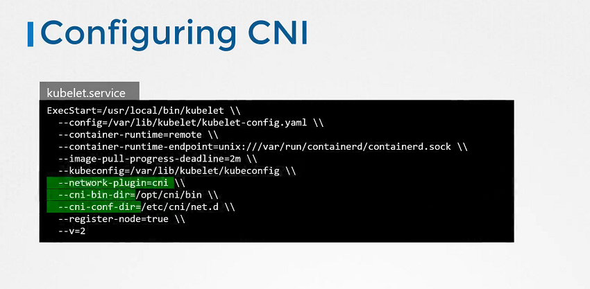

# CNI in Kubernetes

  - Take me to [Lecture](https://kodekloud.com/topic/cni-in-kubernetes/)
In this lecture, the focus is on configuring Container Network Interface (CNI) in Kubernetes. Here's a summary:

1. **Background Recap**: The lecture begins by summarizing the prerequisite knowledge covered in previous lectures, starting from basic networking concepts to the introduction of CNI and supported plugins.

2. **Kubernetes Responsibilities**: Kubernetes is responsible for creating container network namespaces and attaching them to the appropriate network using the specified network plugin.

3. **Configuration in Kubernetes**: The CNI plugin is configured in the `kubelet` service on each node of the Kubernetes cluster. This configuration specifies the network plugin to use, along with related directories and options.

4. **Configuration Details**: Within the `kubelet` configuration, the `network-plugin` option is set to CNI, indicating the use of CNI for networking. Additionally, the `CNI bin directory` contains executable plugins, while the `CNI config directory` holds configuration files for plugins.

5. **Plugin Configuration**: An example configuration file for the bridge plugin is provided, showing the format defined by the CNI standard. Key configurations include defining the bridge type, gateway settings, IP masquerade, and IP address management (IPAM) details.

6. **Practice Exercises**: The lecture concludes by encouraging learners to engage in practice exercises to gain hands-on experience working with CNI in Kubernetes, emphasizing the importance of practical application to reinforce learning.

Overall, the lecture provides insight into configuring CNI in Kubernetes, highlighting the configuration process and the role of CNI plugins in container networking within a Kubernetes cluster.

================================================================================================


In this section, we will take a look at **Container Networking Interface (CNI) in Kubernetes**

## Configuring CNI




- Check the status of the Kubelet Service

```
$ systemctl status kubelet.service
```

## View Kubelet Options

```
$ ps -aux | grep kubelet
```

## Check the Supportable Plugins 

- To check the all supportable plugins available in the `/opt/cni/bin` directory.

```
$ ls /opt/cni/bin

```

## Check the CNI Plugins

- To check the cni plugins which kubelet needs to be used.

```
ls /etc/cni/net.d

```

## Format of Configuration File  


#### References Docs

- https://kubernetes.io/docs/reference/command-line-tools-reference/kubelet/
- https://kubernetes.io/docs/concepts/extend-kubernetes/compute-storage-net/network-plugins/
