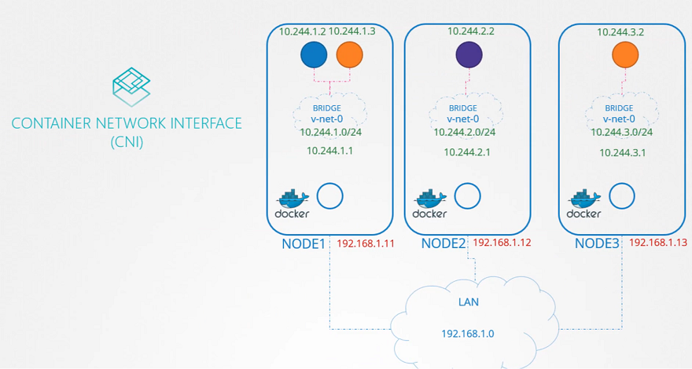
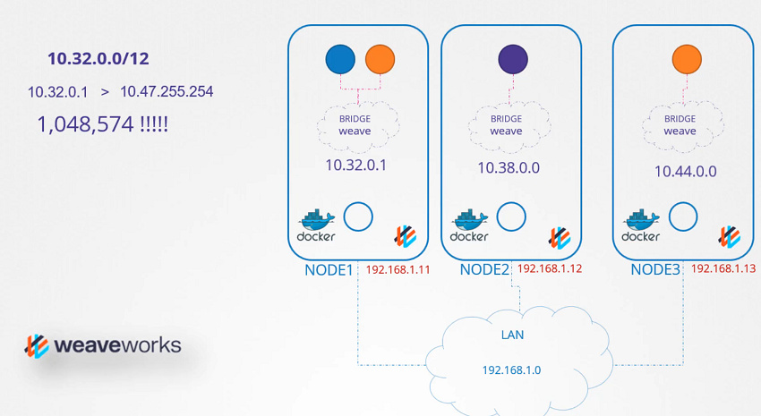

# IPAM weave

  - Take me to [Lecture](https://kodekloud.com/topic/ipam-weave/)
In this lecture, the focus is on IP address management (IPAM) in Kubernetes, specifically how IP addresses are assigned to virtual bridge networks and pods. Here is a summary:

1. **Introduction**:
   - The lecture discusses how IP addresses are managed within a Kubernetes cluster, excluding the IP addresses assigned to the nodes themselves.
   - The focus is on the IP subnets assigned to virtual bridge networks and the IP addresses assigned to pods.

2. **Responsibility**:
   - The CNI (Container Network Interface) plugin is responsible for assigning IP addresses to containers.
   - Kubernetes does not specify how this should be done, only that it should avoid duplicate IP addresses and manage them properly.

3. **Basic Approach**:
   - An easy method is to store a list of IP addresses in a file on each host and ensure the script managing IP addresses handles this file correctly.
   - The CNI standard includes two built-in plugins for this purpose. The "host-local" plugin manages IP addresses locally on each host.

4. **CNI Configuration**:
   - The CNI configuration file includes an IPAM section where the type of plugin, subnet, and route can be specified.
   - Scripts can be made dynamic to support different plugins rather than hard-coding a specific one.

5. **Weaveworks IPAM**:
   - Weaveworks uses a default IP range of 10.32.0.0/12, providing around a million IP addresses (10.32.0.1 to 10.47.255.254) for the network.
   - Weave splits this IP range equally among the nodes, assigning a portion to each node. Pods on these nodes receive IP addresses from this allocated range.
   - The IP ranges are configurable with additional options when deploying the Weave plugin.

6. **Conclusion**:
   - The lecture encourages learners to explore IPAM in the Weave CNI plugin through practice tests.
  
===========================================================================================================

- IP Address Management in the Kubernetes Cluster

- How weaveworks Manages IP addresses in the Kubernetes Cluster 

## References Docs

- https://www.weave.works/docs/net/latest/kubernetes/kube-addon/
- https://kubernetes.io/docs/concepts/cluster-administration/networking/ 
