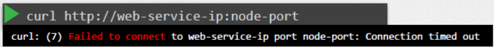
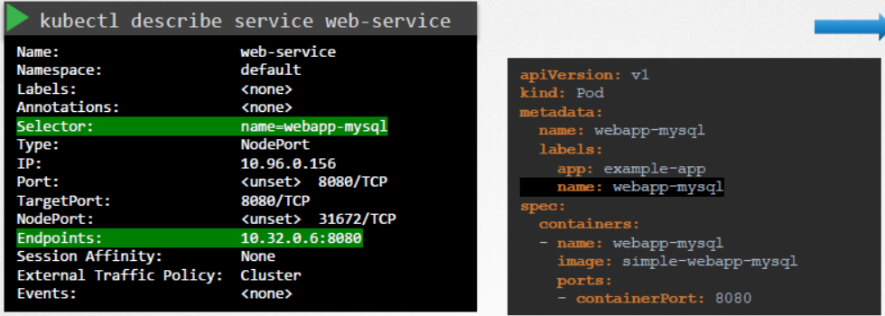
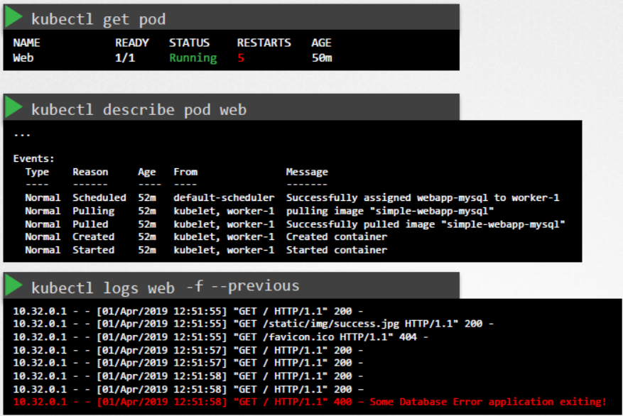

# Application Failure
  
  - Take me to [Lecture](https://kodekloud.com/topic/application-failure/)
In this lecture, the instructor covers troubleshooting techniques for Kubernetes applications. Here's a summary of the key points:

1. **Overview of Troubleshooting**: The instructor emphasizes that troubleshooting is a significant part of Kubernetes administration and provides an overview of troubleshooting techniques and procedures.

2. **Understanding Application Configuration**: Before troubleshooting, it's recommended to have a clear understanding of how the application is configured, including its components and their relationships.

3. **Starting Troubleshooting**: When users report issues, start troubleshooting from either end of the application map, checking every object and link until the root cause is identified.

4. **Troubleshooting Web Server**: Check the accessibility of the web server using standard methods like cURL. Verify if the service has discovered endpoints for the web pod and ensure that selectors match between the service and pod.

5. **Checking Pod Status**: Verify the pod's running state and review its events and logs to identify any issues. If the pod is restarting due to failures, monitor logs for insights or view logs from a previous pod version.

6. **Checking Database Components**: Repeat the same process for the database service and pod, examining logs for any database errors.

7. **Additional Tips**: The instructor mentions that more troubleshooting tips are available in the Kubernetes documentation, which can be helpful for practice tests and exams.

Overall, the lecture provides a structured approach to troubleshooting Kubernetes applications, focusing on identifying and resolving issues systematically.

=====================================================================================


  - In this lecture we will go step by step in troubleshooting Application failure.

  - To check the Application/Service status of the webserver

    ```
    curl http://web-service-ip:node-port
    ```

    

  - To check the endpoint of the service and compare it with the selectors

    ```
    kubectl describe service web-service
    ```   

    


  - To check the status and logs of the pod

    ```
    kubectl get pod
    ```

    ```
    kubectl describe pod web
    ```

    ```
    kubectl logs web
    ```

  - To check the logs of the previous pod

    ```
    kubectl logs web -f --previous
    ```
    
    


  #### Hands on Labs

  - Lets troubleshoot the [Application](https://kodekloud.com/topic/practice-test-application-failure/)
