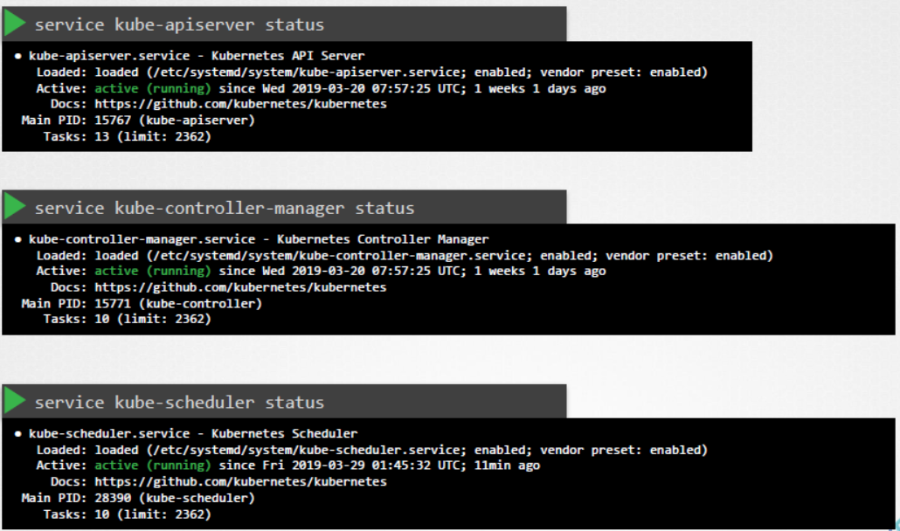
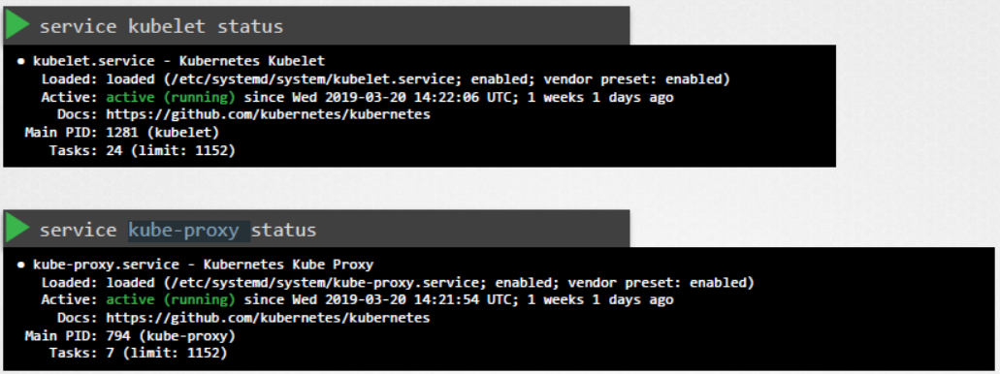
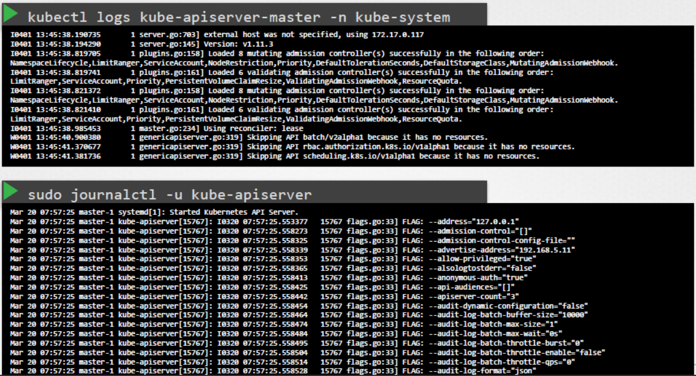

# Control Plane Failure

  - Take me to [Lecture](https://kodekloud.com/topic/control-plane-failure/)
  In this lecture, the instructor focuses on troubleshooting control plane failures in a Kubernetes cluster. Here's a summary of the key points:

1. **Checking Node Health**: Start by verifying the status of all nodes in the cluster to ensure they are healthy.

2. **Checking Pod Status**: If the control plane components are deployed as pods (e.g., using Kubeadm), check the status of the pods in the kube-system namespace to ensure they are running.

3. **Checking Service Status**: If control plane components are deployed as services, inspect the status of these services, such as the kube-apiserver, controller manager, and scheduler on master nodes, and kubelet and kube-proxy service on worker nodes.

4. **Viewing Logs**: Check the logs of control plane components to identify any issues. For clusters deployed with Kubeadm, use the `kubectl logs` command to view pod logs. For services configured natively on master nodes, use the host's logging solution, such as journalctl, to view service logs. For example, use journalctl to view kube-apiserver logs.

5. **Additional Resources**: Refer to the Kubernetes documentation page for more troubleshooting tips, which can be beneficial for practice tests and exams.

This structured approach helps administrators diagnose and resolve control plane failures effectively, ensuring the smooth operation of Kubernetes clusters.

======================================================================================


  - In this lecture we will use how to troubleshoot the Control Plane components.

  - To check the status of the nodes if they are healthy

    ```
    kubectl get nodes
    ```

  - To check the status of the pods if the are running

    ```
    kubectl get pods
    ```

  - To check the status of all the pods of the Control Plane components(if they are deployed with kubeadm tool) and make sure they are **`Running`**

    ```
    kubectl get pods -n kube-system
    ```

    

  - If the Control Plane components are deployed as services then check the status of all the components

    

  - To check the status of **`kube-apiserver`** 

    ```
    service kube-apiserver status
    ```

  - To check the status of **`kube-controller-manager`** 

    ```
    service kube-controller-manager status
    ```

  - To check the status of **`kube-scheduler`** 

    ```
    service kube-scheduler status
    ```

    

  - To check the status of **`kubelet`** 

    ```
    service kubelet status
    ```

  - To check the status of **`kube-proxy`** on the worker nodes.

    ```
    service kube-proxy status
    ```

  - To check the logs of the Control Plane components deployed as Pods:

    ```
    kubectl logs kube-apiserver-master -n kube-system
    ```

    

  - To check the logs of the Control Plane components deployed as SystemD Service

    ```
    sudo journalctl -u kube-apiserver
    ```


