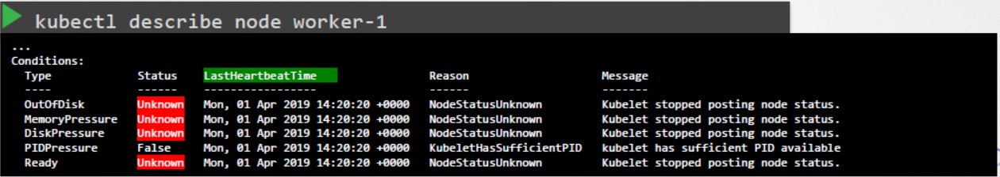
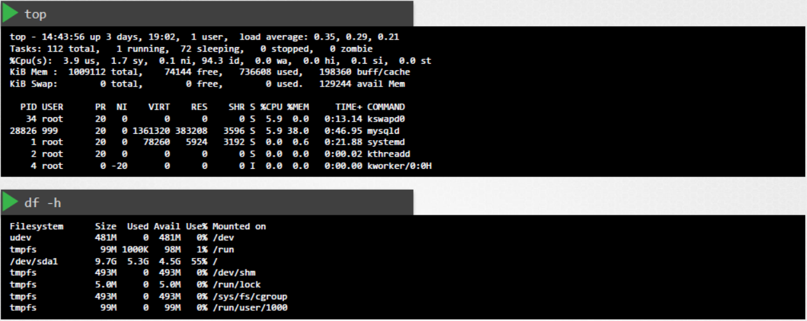

# Worker Node Failure

  - Take me to the [Lecture](https://kodekloud.com/topic/worker-node-failure/)
In this lecture, the focus is on troubleshooting worker node failures in a Kubernetes cluster. Here's a summary of the key points:

1. **Checking Node Status**: Begin by checking the status of nodes in the cluster to determine if they are reported as ready or not ready.

2. **Node Conditions**: Utilize the `kubectl describe node` command to inspect node details, including conditions that may indicate the reason for node failure. Conditions such as out of disk space, memory pressure, disk pressure, PID pressure, and readiness status can provide insights into node health.

3. **Identifying Node Failure**: If a worker node stops communicating with the master, indicating a possible crash, examine the last heartbeat time field to determine when the node might have crashed.

4. **Node Recovery**: Check if the node is online or crashed. If crashed, take steps to bring it back online.

5. **Resource Availability**: Verify CPU, memory, and disk space availability on the nodes.

6. **Kubelet Status and Logs**: Check the status of the kubelet service and review kubelet logs for any potential issues.

7. **Certificates**: Ensure kubelet certificates are not expired, are correctly configured, and issued by the appropriate certificate authority (CA).

8. **Practice**: Engage in practice tests to gain hands-on experience in fixing broken clusters, applying the troubleshooting techniques learned.

This comprehensive approach helps administrators diagnose and resolve worker node failures effectively, ensuring the stability and performance of the Kubernetes cluster.


============================================================================================


  - Lets check the status of the Nodes in the cluster, are they **`Ready`** or **`NotReady`**

    ```
    kubectl get nodes
    ```

  - If they are **`NotReady`** then check the **`LastHeartbeatTime`** of the node to find out the time when node might have crashed

    ```
    kubectl describe node worker-1
    ```

    


  - Check the possible **`CPU`** and **`MEMORY`**  using **`top`** and **`df -h`** 

 
    


  - Check the status and the logs of the **`kubelet`** for the possible issues.

    ```
    serivce kubelet status
    ```

    ```
    sudo journalctl –u kubelet
    ```
    
  
    
  - Check the **`kubelet`** Certificates, they are not expired, and in the right group and issued by the right CA.

    ```
    openssl x509 -in /var/lib/kubelet/worker-1.crt -text
    ```

    


