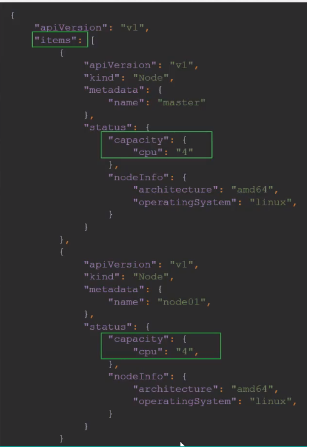
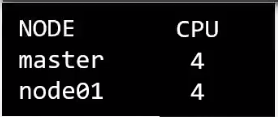

# Advance Kubectl Commands

  - Take me to the [Lecture](https://kodekloud.com/topic/advanced-kubectl-commands/)
In this demo, Mumshad Mannambeth introduces the usage of JSONPath with the Kubectl utility in Kubernetes. Here's a summary of the key points covered:

1. **Introduction to JSONPath**: JSONPath is introduced as a tool for filtering and formatting data retrieved through Kubectl commands. It helps in managing and viewing information about Kubernetes objects efficiently.

2. **Steps for Using JSONPath with Kubectl**:
   - Identify the Kubectl command that provides the required information.
   - Inspect the output of the command in JSON format using the `-o json` option.
   - Understand the structure of the JSON document and form the JSONPath query accordingly.
   - Use the `-o jsonpath` option with the developed JSONPath query to customize the output.

3. **JSONPath Queries**: Several examples of JSONPath queries are provided, such as retrieving node names, hardware architecture, and CPU counts. These queries enable users to extract specific information from the Kubernetes dataset.

4. **Formatting Output**:
   - Newline and tab characters can be inserted to format the output.
   - Loops using the `range` keyword allow iterating through items in a list and printing properties of each item.
   - Custom columns can be defined using the `--custom-columns` option of the Kubectl command.

5. **Sorting Objects**: The `--sort-by` option in Kubectl allows sorting the output based on the value of a property from the JSON formatted properties of each item.

6. **Practice Tests**: Learners are encouraged to engage in practice tests to reinforce their understanding of JSONPath and advanced Kubectl commands.

By following these steps and techniques, users can effectively leverage JSONPath to extract and format data from Kubernetes objects using the Kubectl utility.


==================================================================================================


  - To get the output of **`kubectl`** in a json format: 

    ```
    kubectl get nodes -o json
    ```

    ```
    kubectl get pods -o json 
    ```

    

  - To get the image name used by pod via json path query:

    ```
    kubectl get pods -o=jsonpath='{.items[0].spec.containers[0].image}'
    ```

  - To get the names of node in the cluster:

    ```
    kubectl get pods -o=jsonpath='{.items[*].metadata.name}'
    ```

    


  - To get the architecture of node in the cluster:

    ```
    kubectl get pods -o=jsonpath='{.items[*].status.nodeInfo.architecture}'
    ```

  - To get the count of the cpu of node in the cluster:

    ```
    kubectl get pods -o=jsonpath='{.items[*].status.status.capacity.cpu}'
    ```

  #### Loops - Range

  - To print the output in a separate column (one column with node name and other with CPU count):

    ```
    kubectl get nodes -o=custom-columns=NODE:.metadata.name ,CPU:.status.capacity.cpu
    ```
    
    

  - Kubectl comes with a **`sort by`** property which can be combined with json path query to **`sort`** by name or **`CPU count`**

    ```
    kubectl get nodes --sort-by=.metadata.name
    ```

    

    ```
    kubectl get nodes --sort-by=..status.capacity.cpu
    ```
